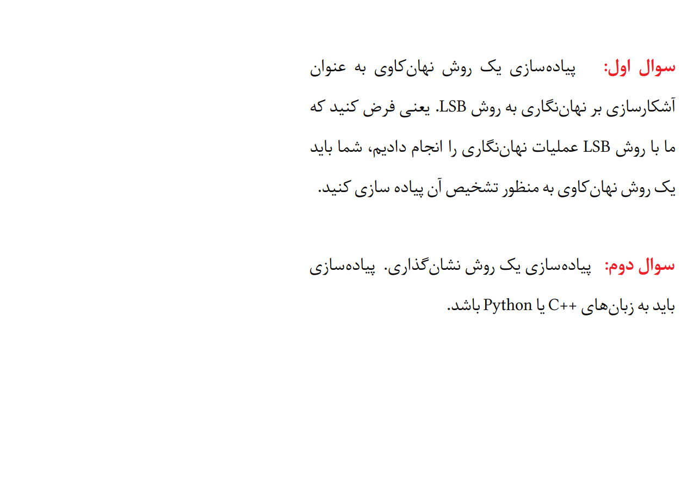

# **🔐 Steganography Project | پروژه نهان‌نگاری**

**A university project in which two Steganography questions are solved with Python.**

**یک پروژه دانشگاهی که در آن دو سوال مربوط به موضوع نهان‌نگاری با پایتون حل می‌شود.**

# 💬 **نکات پروژه**

* برای اجرا برنامه، به پایتون بالاتر از نسخه 3.6 نیاز دارید.
* کتابخانه‌های مورد نیاز در فایل requirements.txt قرار دارند.
* برای دسترسی به همه‌ی پروژه‌های دانشگاهی من، به این لینک مراجعه کنید:

👈🏻 **[پروژه‌های دانشگاهی من](https://github.com/bestmahdi2/Uni__Bachelors_SKU_Path)**

# 📝 **توضیحات پروژه**

